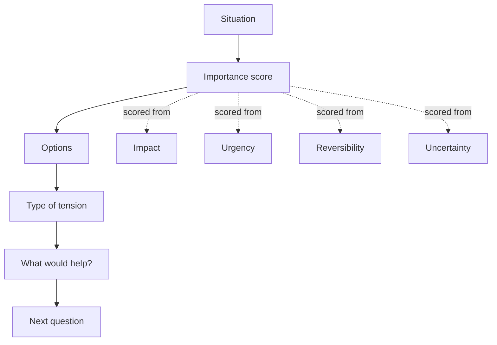
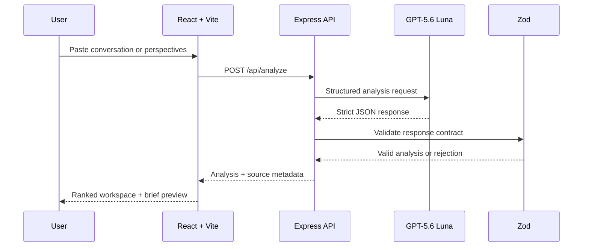
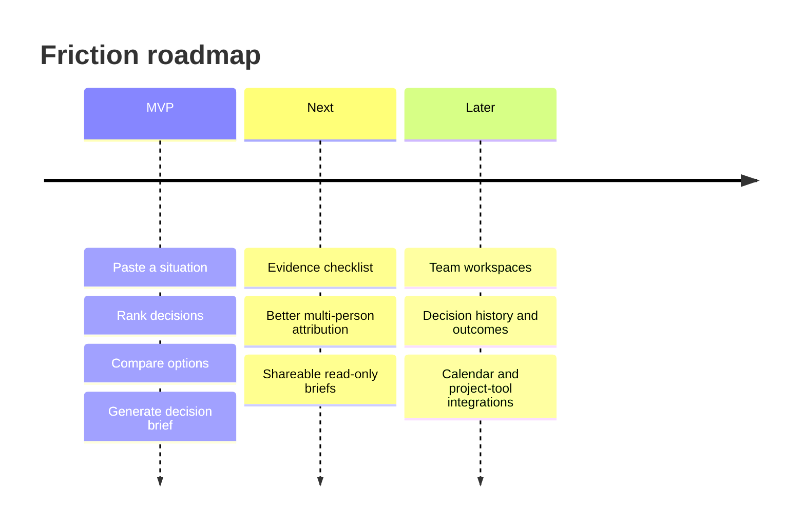

<div align="center">

# `friction`

### Make the next decision feel lighter.

Friction turns messy conversations into ranked decisions, concrete options, and a next question worth answering.

<br />

[](https://github.com/Moustafa-Ameen/friction)
[](https://platform.openai.com/)
[](https://react.dev/)
[](https://www.typescriptlang.org/)
[](#privacy-by-default)

<br />

**Paste the situation. See what matters. Compare the paths. Decide with more clarity.**

</div>

<br />

## The problem

Most decisions do not arrive as clean questions. They arrive as a Slack thread, a tense conversation, three competing opinions, or a feeling that nobody has said the real thing out loud.

Friction is built for that messy first moment.

It does not pretend to know who is right. It separates the decision from the noise around it, then gives people something practical to work with.

## The product loop

```mermaid
flowchart LR
    A[Paste what is going on] --> B[Find the decisions]
    B --> C[Rank what matters]
    C --> D[Compare real options]
    D --> E[Identify the tension]
    E --> F[Ask the next useful question]
    F --> G[Save or share a decision brief]

    style A fill:#f8eee8,stroke:#d95843,color:#1d211f
    style B fill:#fffefa,stroke:#d8d5cd,color:#1d211f
    style C fill:#fffefa,stroke:#d8d5cd,color:#1d211f
    style D fill:#edf3ef,stroke:#4d8f88,color:#1d211f
    style E fill:#fffefa,stroke:#d8d5cd,color:#1d211f
    style F fill:#edf3ef,stroke:#4d8f88,color:#1d211f
    style G fill:#27302b,stroke:#27302b,color:#fffaf3
```



## What makes it different

| Ordinary AI chat | Friction |
| --- | --- |
| Answers the last message | Finds the decisions inside the whole situation |
| Produces one confident paragraph | Shows ranked decisions and competing options |
| Blurs facts, values, and assumptions | Labels the central tension as `FACT`, `VALUE`, `DEFINITION`, or `UNKNOWN` |
| Gives generic advice | Produces a specific “what would help?” action |
| Forgets the decision after the chat | Saves a titled, revisitable decision process locally |
| Requires a perfect prompt | Accepts a rough conversation or two separate perspectives |

## A decision, made visible

Every decision gets a small, inspectable model:



### Importance score

The score is a prioritization aid, not a truth meter:

```text
importance = impact + urgency + irreversibility + uncertainty
```

The model returns a bounded `0-100` score and a plain-English explanation. The interface makes the reasoning visible through the circular score, the tooltip, and the ranked driver list.

### Tension classification

The Analysis tab adds one compact classification instead of burying users in a conflict report:

| Label | Meaning | Example |
| --- | --- | --- |
| `FACT` | A disputed claim could be checked | What caused sprint velocity to drop? |
| `VALUE` | Priorities or definitions of success differ | Is $4M a great outcome or a failure of ambition? |
| `DEFINITION` | The same important word means different things | What does “clean up” mean, and by when? |
| `UNKNOWN` | The text does not establish what is missing | What constraint has not been surfaced yet? |

## Architecture



### Runtime boundaries

```text
Browser
  - React/Vite UI
  - local saved decision processes
  - copy, print, and PDF actions
  - no API key

Server
  - Express /api/analyze
  - input length validation
  - OpenAI Responses API call
  - strict structured output
  - Zod validation
  - local fallback on failure
```

## The interface

The workspace is organized as a decision process rather than a conversation transcript:

1. **Situation** — paste the raw material.
2. **What matters** — see ranked drivers and importance scores.
3. **Options** — compare benefits and drawbacks.
4. **Analysis** — inspect the tension type and the specific missing evidence.
5. **Decision** — add an owner, review date, and create a brief.

The left rail contains saved processes, templates, team preparation, and a private journal. The right brief is optional, resizable, printable, and closed by default so it never competes with the primary workflow.

## Try these scenarios

The product includes ready-to-run examples for:

- Product launch timing
- Project scope and deadlines
- Hiring choices

It also handles less structured inputs, including:

- Manager/report disagreements
- Roommate conflicts
- Values-based founder decisions
- Three-sided family or relationship decisions

## API

`POST /api/analyze`

### Request

```json
{
  "decision": "",
  "mode": "transcript",
  "transcript": "Maya wants to launch Friday. Jon says onboarding still breaks for new users."
}
```

For two explicit perspectives:

```json
{
  "decision": "Should we change the hybrid schedule?",
  "mode": "perspectives",
  "sideA": "The team needs more in-person collaboration.",
  "sideB": "The current arrangement was described as permanent."
}
```

### Response shape

```ts
type DecisionAnalysis = {
  summary: string
  decisions: Array<{
    title: string
    importanceScore: number
    scoreReason: string
    situation: string
    disagreementType: 'FACT' | 'VALUE' | 'DEFINITION' | 'UNKNOWN'
    whatWouldHelp: string
    options: Array<{
      title: string
      description: string
      benefits: string[]
      drawbacks: string[]
    }>
    nextQuestion: string
  }>
}
```

The server rejects empty or oversized input. Model output is requested with a strict JSON schema and validated again with Zod before the browser renders it.

## Run it locally

Requirements: **Node.js 20+**

```powershell
npm.cmd install
Copy-Item .env.example .env
npm.cmd run dev:all
```

Open `http://127.0.0.1:5173`.

The app runs without an API key using the local fallback. For live analysis, add a capped personal key to `.env`:

```dotenv
OPENAI_API_KEY=your_key_here
OPENAI_MODEL=gpt-5.6-luna
OPENAI_MAX_OUTPUT_TOKENS=1600
PORT=8787
```

The API key is loaded by Express only. It is never bundled into browser JavaScript.

### Separate processes

```powershell
npm.cmd run dev
npm.cmd run dev:server
```

### Production build

```powershell
npm.cmd run build
npm.cmd start
```

## Privacy by default

- Conversations are not written to a database.
- The browser stores saved decision processes only in its own `localStorage`.
- The API key stays server-side.
- Inputs are capped before reaching the model.
- Copying or printing a decision brief does not create another model request.

Friction organizes decisions. It does not determine who is right and is not legal, medical, or financial advice.

## Codex + GPT-5.6

### Where GPT-5.6 runs

GPT-5.6 Luna is the runtime reasoning layer. It extracts decisions, ranks importance, generates options, classifies the central tension, and proposes a specific next question.

### Where Codex contributed

Codex was used as the development-time engineering partner across the build:

- Reframed the original conflict analyzer into a decision inbox.
- Designed the React/Vite workspace and five-step information architecture.
- Implemented the Express server boundary so the API key never reaches the browser.
- Built strict structured-output schemas and Zod validation.
- Debugged malformed model responses and fallback behavior.
- Implemented the responsive layout, saved processes, PDF brief, resizable rails, and local navigation pages.
- Audited the live analysis flow against manager/report, roommate, values-based, and three-sided scenarios.

Codex is not a runtime agent inside Friction. At runtime, GPT-5.6 Luna analyzes the input and the browser renders the validated result.

## Quality gates

```text
Build                         PASS
Server TypeScript audit       PASS
Fallback schema validation    PASS
Strict model response schema  PASS
API key browser scan          PASS
Mobile overflow check         PASS
Saved process reload          PASS
Brief resize interaction      PASS
```

## Roadmap



The roadmap deliberately leaves authentication, databases, OAuth integrations, and collaboration infrastructure out of the hackathon build. The core decision loop comes first.

## Project status

Friction is a standalone hackathon project built for OpenAI Build Week under the **Work & Productivity** category.

The product is intentionally opinionated: fewer generic sections, clearer labels, explicit uncertainty, and a decision brief that someone can actually use after the conversation ends.

<div align="center">

### Less circular debate. More visible decisions.

</div>
