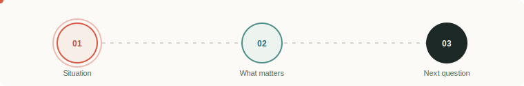
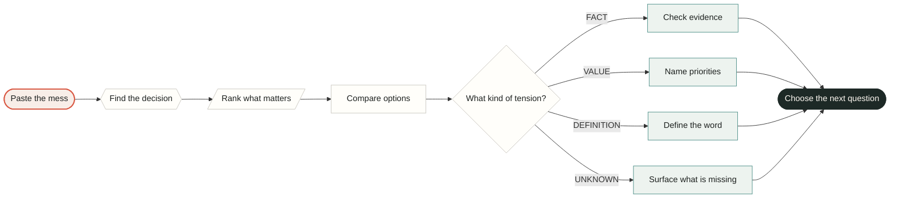
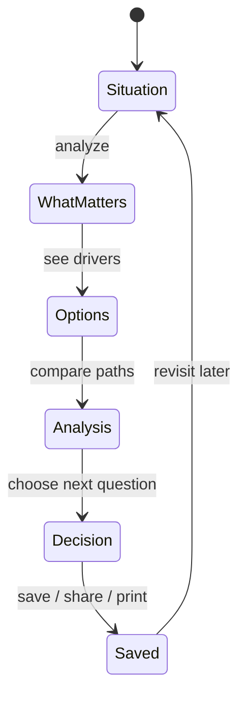
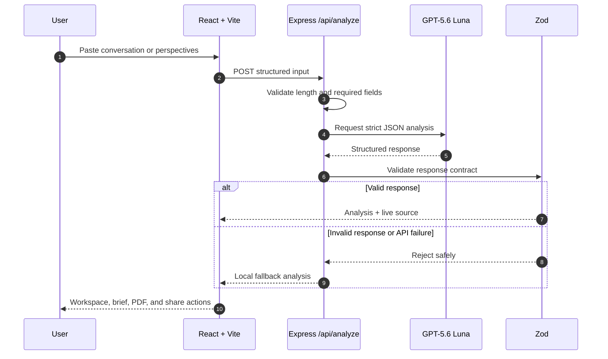
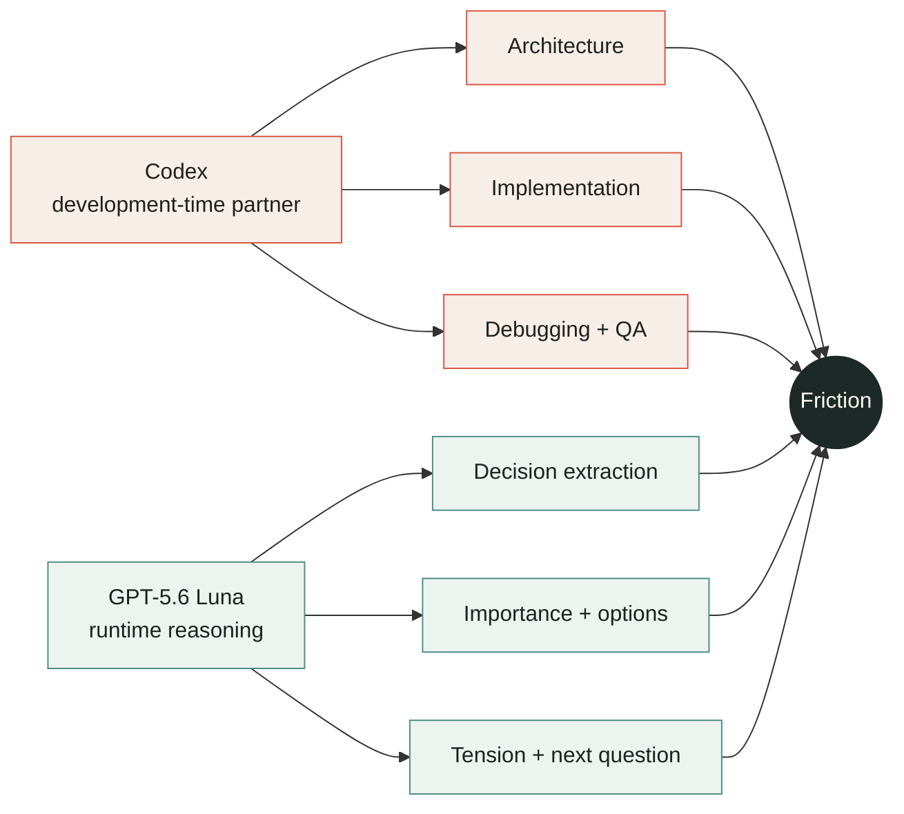
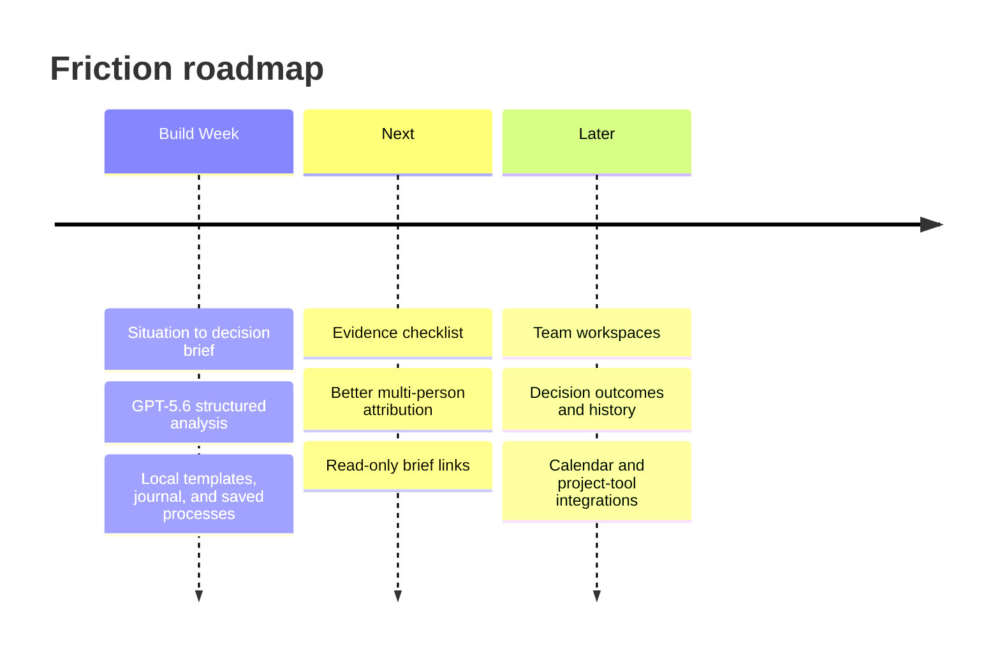

<div align="center">

# `friction`

### Make the next decision feel lighter.

<p><strong>Friction turns messy conversations into ranked decisions, visible tradeoffs, and a next question worth answering.</strong></p>

<p>
  <a href="#the-loop">The loop</a> &nbsp; | &nbsp;
  <a href="#run-it">Run it</a> &nbsp; | &nbsp;
  <a href="#architecture">Architecture</a> &nbsp; | &nbsp;
  <a href="#codex--gpt-56">AI build story</a>
</p>

[](https://github.com/Moustafa-Ameen/friction)
[](https://platform.openai.com/)
[](https://react.dev/)
[](#privacy)

<br />



</div>

<br />

> **A decision system for the moment before the decision.**
>
> Paste the raw conversation. Friction finds what is being decided, shows what matters, compares the paths, and gives you a concrete next move.

<table>
<tr>
<td width="33%" bgcolor="#f8eee8"><strong>01 / SEE IT</strong><br /><br />Find the real decision inside the noise.</td>
<td width="33%" bgcolor="#edf3ef"><strong>02 / WEIGH IT</strong><br /><br />Rank importance and compare upside against risk.</td>
<td width="33%" bgcolor="#f6f1e4"><strong>03 / MOVE IT</strong><br /><br />Save, share, print, and revisit a clear path.</td>
</tr>
</table>

## Why Friction exists

Most decisions do not arrive as clean questions. They arrive as a Slack thread, a tense conversation, three competing opinions, or a feeling that nobody has said the real thing out loud.

Friction is built for that messy first moment. It does not decide who is right. It makes the decision inspectable.

<div align="center">



*The flow is deliberately progressive: every screen answers one human question before moving to the next.*

</div>

## The product loop

<table>
<tr><th>Step</th><th>What the user sees</th><th>Why it matters</th></tr>
<tr><td><strong>Situation</strong></td><td>A conversation, rough notes, or two perspectives</td><td>No perfect prompt required</td></tr>
<tr><td><strong>What matters</strong></td><td>Decision drivers and a 0-100 importance score</td><td>Urgency becomes visible without pretending to be certainty</td></tr>
<tr><td><strong>Options</strong></td><td>Ranked paths with benefits and drawbacks</td><td>The user can compare instead of arguing in circles</td></tr>
<tr><td><strong>Analysis</strong></td><td>FACT, VALUE, DEFINITION, or UNKNOWN tension</td><td>The disagreement gets a useful category</td></tr>
<tr><td><strong>Decision</strong></td><td>Owner, review date, brief, PDF, and share action</td><td>Insight becomes something a person can act on</td></tr>
</table>

### A small, inspectable model



<details>
<summary><strong>What Friction does not do</strong></summary>

Friction does not diagnose people, assign blame, decide who is right, or present uncertain claims as facts. It organizes a decision so the people involved can make the judgment.

</details>

## What makes it different

| Ordinary AI chat | Friction |
| --- | --- |
| Answers the last message | Finds decisions inside the whole situation |
| Produces one confident paragraph | Shows ranked decisions and competing options |
| Blurs facts, values, and assumptions | Labels the central tension explicitly |
| Gives generic advice | Produces a specific, checkable next question |
| Forgets the decision after the chat | Saves a titled process locally for later |
| Requires a perfect prompt | Accepts a rough conversation or two perspectives |

## Built for demonstration

The app ships with realistic scenarios so a first-time user can understand the product in seconds:

<table>
<tr>
<td bgcolor="#f8eee8"><strong>Product launch</strong><br />Launch Friday or wait for onboarding fixes?</td>
<td bgcolor="#edf3ef"><strong>Project scope</strong><br />Cut the feature or move the deadline?</td>
<td bgcolor="#f6f1e4"><strong>Hiring choice</strong><br />Choose experience or long-term fit?</td>
</tr>
<tr>
<td><strong>Pricing strategy</strong><br />Flat subscription or usage-based pricing?</td>
<td><strong>Office location</strong><br />Move for collaboration or keep cost stability?</td>
<td><strong>Website redesign</strong><br />Improve comprehension or protect engineering focus?</td>
</tr>
</table>

The interface also gracefully handles manager/report disagreements, roommate disputes, values-based founder decisions, and three-sided family choices.

## Architecture



### Runtime boundaries

```text
Browser
  React/Vite UI, local saved processes, templates, journal notes
  Copy, native share, print/PDF actions
  No API key

Server
  Express /api/analyze
  Input caps and request validation
  OpenAI Responses API call
  Strict structured output + Zod validation
  Fallback response when live analysis is unavailable
```

<details>
<summary><strong>API contract</strong></summary>

`POST /api/analyze`

```json
{
  "decision": "Should we change the hybrid schedule?",
  "mode": "perspectives",
  "sideA": "The team needs more in-person collaboration.",
  "sideB": "The current arrangement was described as permanent."
}
```

The response is validated before rendering:

```ts
type DecisionAnalysis = {
  summary: string
  decisions: Array<{
    title: string
    importanceScore: number
    scoreReason: string
    situation: string
    disagreementType: 'FACT' | 'VALUE' | 'DEFINITION' | 'UNKNOWN'
    whatWouldHelp: string
    options: Array<{
      title: string
      description: string
      benefits: string[]
      drawbacks: string[]
    }>
    nextQuestion: string
  }>
}
```

</details>

## Run it

Requirements: **Node.js 20+**

```powershell
npm.cmd install
Copy-Item .env.example .env
npm.cmd run dev:all
```

Open `http://127.0.0.1:5173`.

The app runs without an API key using local fallback analysis. For live analysis, add a capped personal key to `.env`:

```dotenv
OPENAI_API_KEY=your_key_here
OPENAI_MODEL=gpt-5.6-luna
OPENAI_MAX_OUTPUT_TOKENS=1600
PORT=8787
```

The key is loaded by Express only and is never bundled into browser JavaScript.

```powershell
# Separate processes
npm.cmd run dev
npm.cmd run dev:server

# Production build
npm.cmd run build
npm.cmd start
```

## Privacy

<table>
<tr><td bgcolor="#edf3ef"><strong>No database</strong><br />Conversations are not written to a database.</td><td bgcolor="#f8eee8"><strong>Local storage</strong><br />Saved decisions, templates, and journal notes stay in this browser.</td></tr>
<tr><td><strong>Server-side key</strong><br />The API key never enters browser JavaScript.</td><td><strong>No surprise calls</strong><br />Copying or printing a brief does not create another model request.</td></tr>
</table>

Friction organizes decisions. It does not provide legal, medical, or financial advice.

## Codex + GPT-5.6



### Codex contributed to

- Reframing the original conflict analyzer into a decision workspace.
- Designing the React/Vite information architecture and responsive layout.
- Implementing the Express server boundary so the key stays server-side.
- Building strict structured-output schemas and Zod validation.
- Debugging malformed responses, fallback behavior, and mobile layout issues.
- Implementing saved processes, templates, journal notes, decision sharing, PDF briefs, and resizable navigation.
- Testing manager/report, roommate, values-based, and three-sided scenarios.

### GPT-5.6 Luna runs at runtime

GPT-5.6 Luna extracts decisions, ranks importance, generates options, classifies the central tension, and proposes a specific next question. Codex is not represented as a runtime agent inside the product.

## Quality gates

| Check | Result |
| --- | :---: |
| Production build | `PASS` |
| Server TypeScript audit | `PASS` |
| Fallback schema validation | `PASS` |
| Strict model response validation | `PASS` |
| API key browser scan | `PASS` |
| Mobile overflow check | `PASS` |
| Saved process reload | `PASS` |
| Brief resize interaction | `PASS` |

## Roadmap



The roadmap deliberately leaves authentication, databases, OAuth, and collaboration infrastructure out of the hackathon build. The core decision loop comes first.

<div align="center">

### Less circular debate. More visible decisions.

<sub>Built with React, Express, Zod, GPT-5.6 Luna, and Codex.</sub>

</div>
